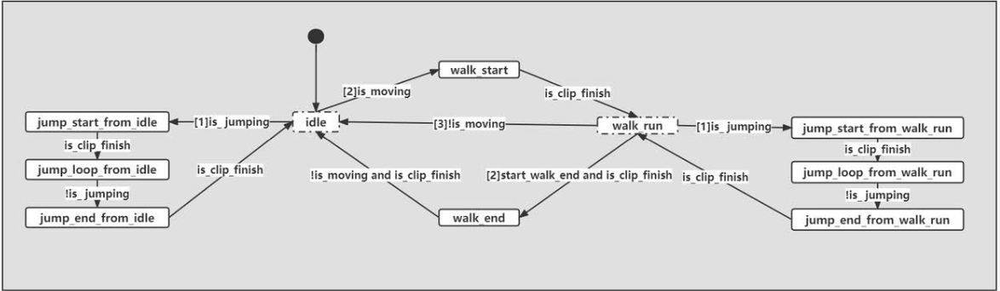

# game104 作业3 报告

1. 状态机 update 思路

    待实现状态机：
    

    状态机实现代码：

    ```c++
    void AnimationFSM::setStates(States state)
    {
        LOG_INFO("state change {} -> {}",StatesName[m_state].c_str(), StatesName[state].c_str());
        m_state = state;
    }

    bool AnimationFSM::update(const json11::Json::object& signals)
    {
        States last_state     = m_state;
        bool   is_clip_finish = tryGetBool(signals, "clip_finish", false);
        bool   is_jumping     = tryGetBool(signals, "jumping", false);
        float  speed          = tryGetFloat(signals, "speed", 0);
        bool   is_moving      = speed > 0.01f;
        bool   start_walk_end = false;

        switch (m_state)
        {
            case States::_idle:
                if (is_jumping) setStates(States::_jump_start_from_idle);
                else if (is_moving) setStates(States::_walk_start);            
                break;
            case States::_walk_start:
                if (is_clip_finish) setStates(States::_walk_run);                
                break;
            case States::_walk_run:
                if (is_jumping) setStates(States::_jump_start_from_walk_run);
                else if (start_walk_end && is_clip_finish) setStates(States::_walk_stop);
                else if (!is_moving) setStates(States::_idle);
                break;
            case States::_walk_stop:
                if (!is_moving && is_clip_finish) setStates(States::_idle);
                break;
            case States::_jump_start_from_idle:
                if (is_clip_finish) setStates(States::_jump_loop_from_idle);
                break;
            case States::_jump_loop_from_idle:
                if (!is_jumping) setStates(States::_jump_end_from_idle);
                break;
            case States::_jump_end_from_idle:
                if (is_clip_finish) setStates(States::_idle);
                break;
            case States::_jump_start_from_walk_run:
                if (is_clip_finish) setStates(States::_jump_loop_from_walk_run);
                break;
            case States::_jump_loop_from_walk_run:
                if (!is_jumping) setStates(States::_jump_end_from_walk_run);
                break;
            case States::_jump_end_from_walk_run:
                if (is_clip_finish) setStates(States::_walk_run);
                break;
            default:
                setStates(States::_idle);
                break;
        }
        return last_state != m_state;
    }
    ```
    
    实现结果验证：
    
    ``` log
    [info] [setStates] state change _idle -> _walk_start
    [info] [setStates] state change _walk_start -> _walk_run
    [info] [setStates] state change _walk_run -> _jump_start_from_walk_run
    [info] [setStates] state change _jump_start_from_walk_run -> _jump_loop_from_walk_run
    [info] [setStates] state change _jump_loop_from_walk_run -> _jump_end_from_walk_run
    [info] [setStates] state change _jump_end_from_walk_run -> _walk_run
    [info] [setStates] state change _walk_run -> _jump_start_from_walk_run
    [info] [setStates] state change _jump_start_from_walk_run -> _jump_loop_from_walk_run
    [info] [setStates] state change _jump_loop_from_walk_run -> _jump_end_from_walk_run
    [info] [setStates] state change _jump_end_from_walk_run -> _walk_run
    [info] [setStates] state change _walk_run -> _idle
    [info] [setStates] state change _idle -> _jump_start_from_idle
    [info] [setStates] state change _jump_start_from_idle -> _jump_loop_from_idle
    [info] [setStates] state change _jump_loop_from_idle -> _jump_end_from_idle
    [info] [setStates] state change _jump_end_from_idle -> _idle
    ```

    增加 **setStates** 函数以实现统一更改状态，状态机的优先级通过 **if** 判断的优先级来实现。经验证，输出与预期相符。

2. animation blend 实现

    该函数通 weight 对传入的值取值，以达到对不同动画的混合
    
    混合函数（python实现）: ```np.array(weights) @ np.array(values) / np.sum(weights) ```

    blend 函数实现：    
    ```c++
    //按weight与目标插值
    void AnimationPose::blend(const AnimationPose& pose)
    {
        for (int i = 0; i < m_bone_poses.size(); i++)
        {
            auto&       bone_trans_one = m_bone_poses[i];
            const auto& bone_trans_two = pose.m_bone_poses[i];

            float sum_weight = m_weight.m_blend_weight[i] + pose.m_weight.m_blend_weight[i];
            if (sum_weight != 0)
            {
                float cur_weight = m_weight.m_blend_weight[i]/sum_weight;
                m_weight.m_blend_weight[i] = sum_weight;
                bone_trans_one.m_position  = Vector3::lerp( bone_trans_two.m_position, bone_trans_one.m_position, cur_weight);
                bone_trans_one.m_scale     = Vector3::lerp( bone_trans_two.m_scale, bone_trans_one.m_scale, cur_weight);
                bone_trans_one.m_rotation  = Quaternion::nLerp(cur_weight, bone_trans_two.m_rotation, bone_trans_one.m_rotation, true);            
            }
        }
    }
    ```

3. move 函数
    
    该函数缺失部分为水平方向移动计算，因此仿照垂直计算可得

    ```c++
    // side pass 水平方向计算
    if (physics_scene->sweep(
        m_rigidbody_shape,
        world_transform.getMatrix(),
        horizontal_direction,
        horizontal_displacement.length(),
        hits))
    {
        final_position += hits[0].hit_distance * horizontal_direction;
    }
    else
    {
        final_position += horizontal_displacement;
    }
    ```
